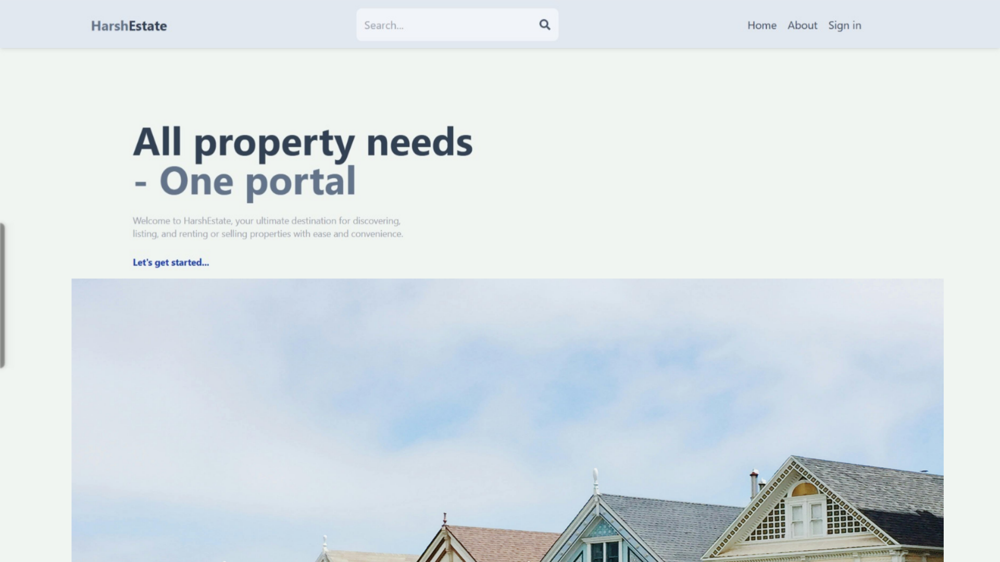
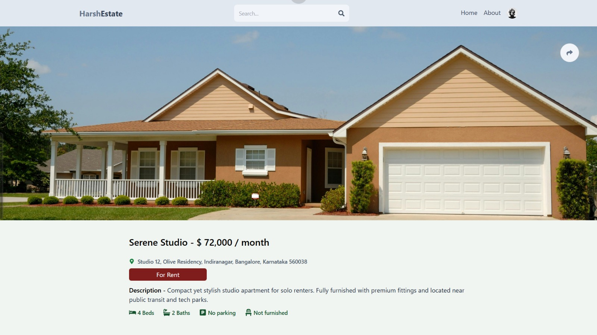
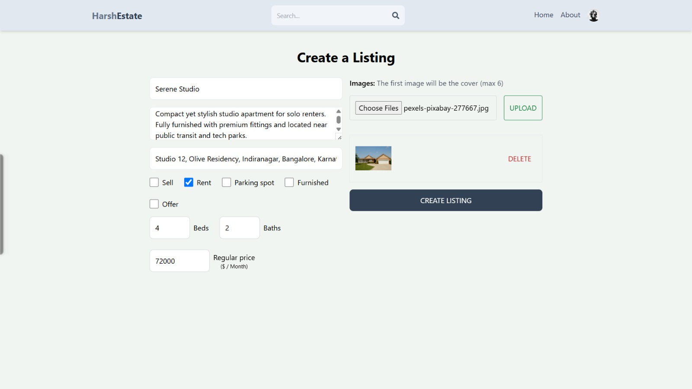
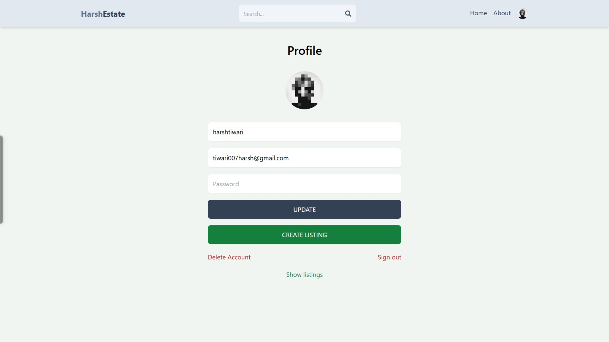
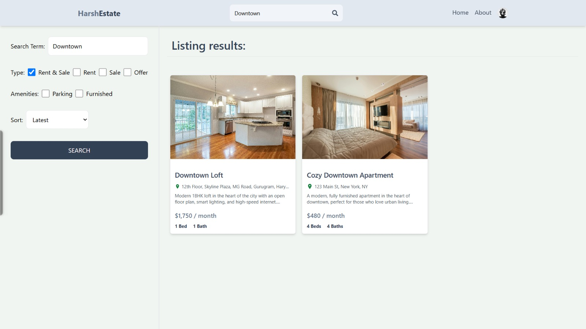
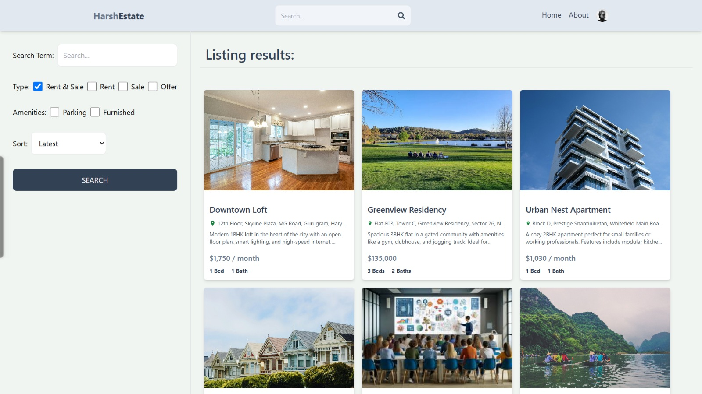

# 🏡 harshEstate

**harshEstate** is a modern **MERN stack** marketplace application where users can list, search, filter, share, and manage items for sale, rent, or purchase.  
Originally designed for real estate listings, it has evolved into a **multi-purpose listing platform**.

---

## 🚀 Features

- 🔐 **User Authentication**
  - Email & password authentication  
  - **Google Sign-In** via Firebase  
  - JWT-protected backend routes  
- 🏷️ **Create Listings** — Add details, pricing, category, and images  
- ✏️ **Update Listings** — Modify your existing posts anytime  
- 🗑️ **Delete Listings** — Remove your listings permanently  
- 📋 **View Your Listings** — See all listings created by you  
- 🔍 **Search & Filter** — Search by keywords, category, price range, condition, and availability  
- 🔗 **Share Listings** — Copy direct links to send to others  
- 🖼️ **Image Uploads** — Multiple images per listing  
- 🧭 **Responsive UI** — Works on all devices  
- 🧠 **Secure API** — Protected endpoints with token verification  

---

## 🖼️ Screenshots

> *(Place your screenshots in an `assets` folder and update the paths below)*  

### 🏠 Landing Page  
  

### 📋 Listing Details  
  

### ✍️ Create Listing  
  

### 🙍 Profile Page (Your Listings)  
  

### 🔎 Search Listings  
  

### 🎯 Search with Filters  
  

---

## 🛠️ Tech Stack

**Frontend:**  
- React.js (Vite)  
- Tailwind CSS  
- React Router  
- Firebase Authentication (Google Sign-In)  

**Backend:**  
- Node.js  
- Express.js  
- MongoDB (Mongoose)  
- JWT Authentication  
- Multer (for image uploads)  

**Other Tools:**  
- Axios (HTTP requests)  
- Dotenv (environment variables)  

---

## 📂 Folder Structure

```plaintext
/harshEstate
│
├── /frontend
│   ├── /public
│   ├── /src
│   │   ├── /assets
│   │   ├── /components
│   │   ├── /pages
│   │   ├── App.jsx
│   │   ├── main.jsx
│   │   └── ...
│   ├── package.json
│   └── vite.config.js
│
├── /backend
│   ├── /controllers
│   ├── /models
│   ├── /routes
│   ├── /uploads
│   ├── /utils
│   ├── index.js
│   ├── package.json
│   └── .env
│
└── README.md
